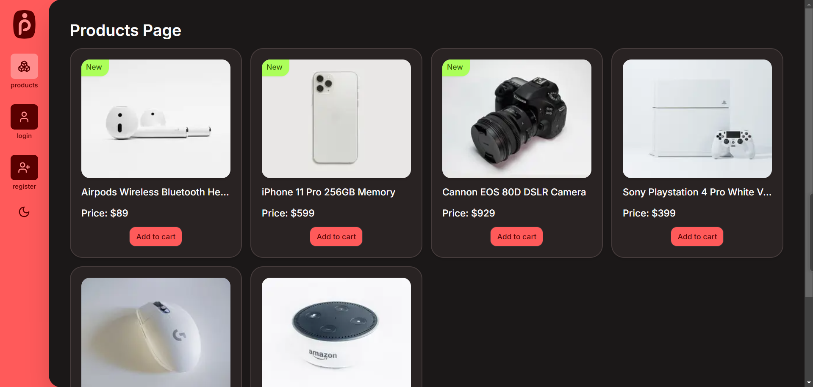

# [Profile.fyi Assignment](https://profile-sanchit.vercel.app/)

A Ecommerce Cart Application

[](https://profile-sanchit.vercel.app/)

Demo [https://drive.google.com/file/d/1KQeHVDgoQdq60wY6tnMd1Gq4vbZB1Tfv/view?usp=sharing](video)

## Tech Stack

- Typescript
- Next.js
- Tailwind CSS
- TanStack Query
- Zustand

## Getting Started

First Install dependencies. Run the following command:

```bash
npm install
# or
yarn install
# or
pnpm install
# or
bun install
```

First, run the development server:

```bash
npm run dev
# or
yarn dev
# or
pnpm dev
# or
bun dev
```

Open [http://localhost:3000](http://localhost:3000) with your browser to see the result.
